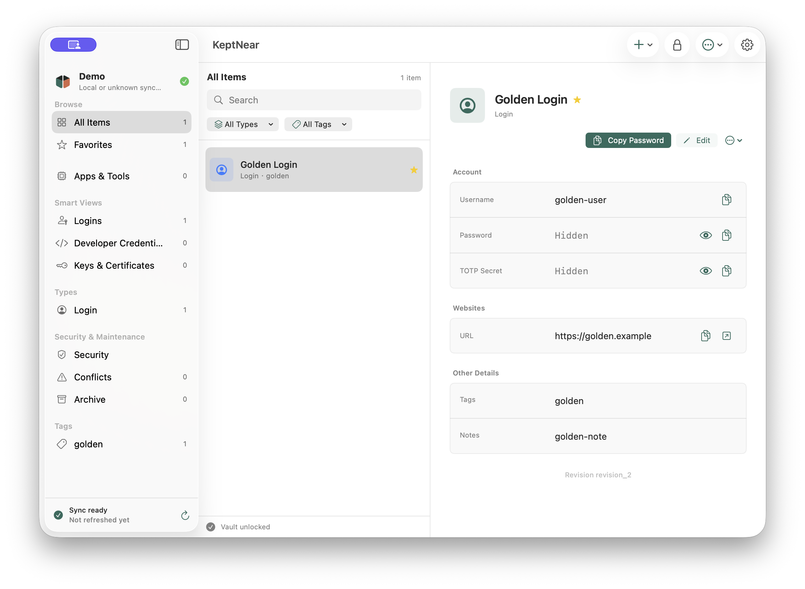
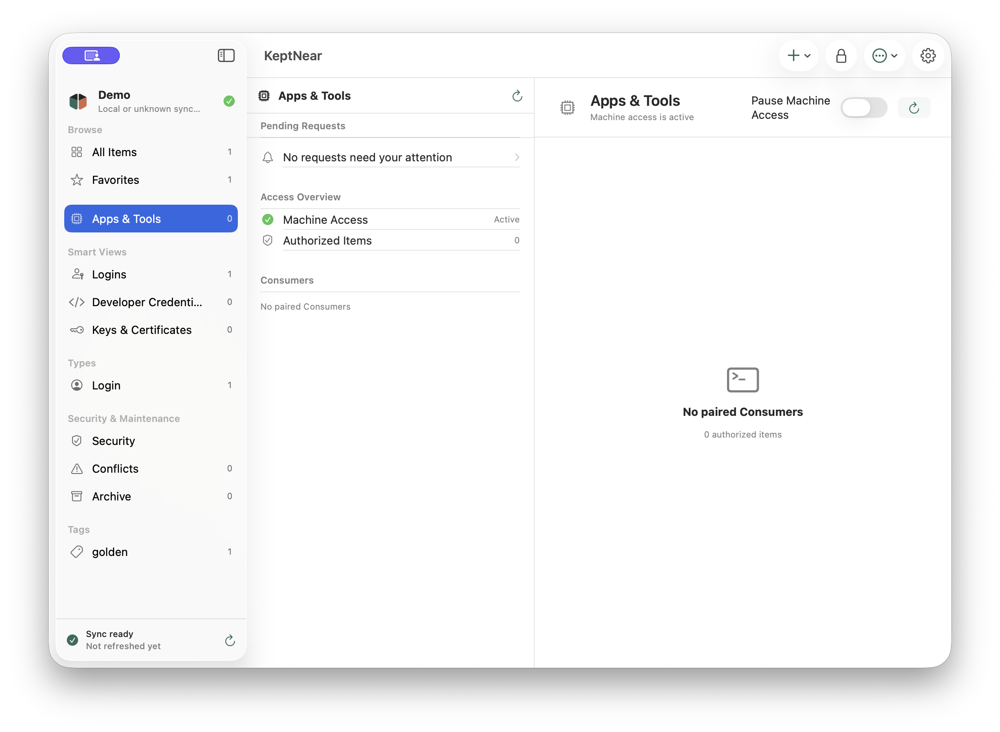

<p align="center">
  <picture>
    <source media="(prefers-color-scheme: dark)" srcset="assets/brand/keptnear-lockup-dark.svg">
    <source media="(prefers-color-scheme: light)" srcset="assets/brand/keptnear-lockup.svg">
    
  </picture>
</p>

<p align="center"><strong>Local Password &amp; Token Manager</strong></p>

<p align="center">
  <a href="README.md">English</a> ·
  <a href="README.zh-CN.md">简体中文</a> ·
  <a href="https://github.com/chasechou007/KeptNear/releases/tag/v0.1.0-prealpha.2">Download</a> ·
  <a href="docs/product-overview.md">Product</a> ·
  <a href="docs/security-model.md">Security</a>
</p>

> Keep passwords, tokens, and keys in a local encrypted vault, and decide which
> applications and tools may use them.

KeptNear is an open-source, local-first password and token manager. Your data
lives in a user-controlled encrypted `.pswvault` directory. You choose where
that vault is stored and whether an untrusted file provider such as iCloud
Drive, Dropbox, Syncthing, or WebDAV transports its encrypted files.

The native macOS app is the human control plane. KeptNear is also being built
for local applications, CLI tools, and MCP hosts that need to use a selected
credential without receiving the rest of the vault or placing raw secrets in
ordinary Agent conversations and tool output.

<p align="center">
  
</p>
<p align="center"><sub>Native macOS vault workspace using synthetic fixture data.</sub></p>

## Why KeptNear

- **Your vault stays yours.** KeptNear requires no account and operates no
  hosted vault or sync service.
- **File sync remains a transport.** External providers can copy encrypted
  vault files, but they never become KeptNear's trust boundary.
- **Passwords and developer credentials belong together.** Logins, secure
  notes, cards, software licenses, API tokens, keys, certificates, and custom
  fields share one extensible encrypted model.
- **Machine access is explicit.** The planned end-user flow pairs each local
  Consumer and scopes access to selected secret fields and approved operations.
- **The daily experience is native.** The first client is a SwiftUI macOS app
  backed by a reusable Rust core.
- **The boundaries are inspectable.** Vault format, architecture, security
  assumptions, logging, packaging, and release gates are documented in public.

## Project Status

> [!WARNING]
> KeptNear is experimental pre-alpha software and has not received an external security audit.
> This release remains unaudited. Do not use it to store production passwords,
> tokens, keys, or other credentials.

An unsigned Apple Silicon DMG is published as an experimental GitHub pre-release
for macOS 13 or newer. It is not signed with an Apple Developer ID and is not
notarized, so macOS cannot verify the publisher identity and may block the first
launch.

The source and unsigned preview are published through bounded maintainer
accepted-risk records `AR-001` and `AR-002`. Those records permit transparent
experimental evaluation; they do not make KeptNear audited, production-ready,
or suitable for important credentials.

Current release:
[v0.1.0-prealpha.2](https://github.com/chasechou007/KeptNear/releases/tag/v0.1.0-prealpha.2).
The agreed next product milestone is `v0.2.0-alpha.1`.

## How It Works

```text
Human
  └─ macOS App ────────────────┐
                               ├─ encrypted .pswvault
Local application or tool     │
  └─ MCP / CLI ─ Local Broker ┘
                   ├─ pairing
                   ├─ field-scoped authorization
                   ├─ user approval and grants
                   └─ secret-free local audit
```

The portable vault contains encrypted credential data. Device trust,
application pairing, grants, approvals, and audit state stay device-local and
are not copied with the vault. MCP and CLI expose approved operations rather
than a generic raw-secret retrieval command.

<p align="center">
  
</p>
<p align="center"><sub>Source-build Apps &amp; Tools control surface. End-user machine access remains a developer preview.</sub></p>

Read the [Product Overview](docs/product-overview.md) for the complete product
model and [Architecture](docs/architecture.md) for implementation boundaries.

## Capability Status

Source implementation, bundled components, and released user workflows are
deliberately reported as different states.

### Available In The macOS Source Build

- Create, open, unlock, lock, recover, back up, restore, and file-sync local
  encrypted vaults.
- Create and manage logins, secure notes, cards, software licenses, API tokens,
  API keys, SSH keys, certificates, and custom credentials.
- Search, favorites, tags, password generation, TOTP, password health,
  managed clipboard clearing, auto-lock, import/export, and explicit conflict
  resolution.
- Use English, Simplified Chinese, or Japanese in the native macOS interface.

### Implemented And Tested In Source

- A device-local Broker with encrypted trust state, paired Consumer identity,
  field-scoped authorization, approvals, grants, global pause, and secret-free
  audit.
- A six-tool MCP adapter and typed `keptnear` CLI over the authenticated
  `keptnear.broker/1.0` protocol.
- Brokered HTTPS and direct child-process compatibility operations that avoid
  returning raw credentials through normal machine results.

These machine interfaces require a compatible Broker process and remain a
source-level developer preview.

### Bundled But Not Activated

The Apple Silicon package includes the App, Broker, MCP adapter, CLI, FFI
library, and a closed protocol manifest. Copying `KeptNear.app` to Applications
does not install or activate a long-running Broker service or complete the
pairing, approval, restart, upgrade, and uninstall lifecycle.

### Not Shipped

- End-user MCP or CLI machine credential access is not a released product
  capability.
- No signed or notarized binary is available.
- No hosted vault, KeptNear account, telemetry upload, automatic update, or
  provider sync service is operated by KeptNear.
- No release profile recommends production-secret use.

See [Capability Status](docs/capability-status.md) for evidence behind each
label.

## Download The Current Preview

The current binary preview supports **Apple Silicon (`arm64`) only** on
**macOS 13 or newer**.

1. Download the DMG and checksum from
   [v0.1.0-prealpha.2](https://github.com/chasechou007/KeptNear/releases/tag/v0.1.0-prealpha.2).
2. From the download directory, verify the image:

   ```sh
   shasum -a 256 -c KeptNear-0.1.0-prealpha.2-macos-arm64.dmg.sha256
   ```

3. Open the DMG and drag `KeptNear.app` to Applications.
4. Review the
   [unsigned installation guide](docs/macos-alpha-packaging.md#install-an-unsigned-experimental-dmg)
   before opening it. Never disable Gatekeeper globally for KeptNear.

The published DMG SHA-256 is:

```text
b926247539f2c3ad8d2ebcf6f5d60f04bbe60db3081b180b45a1d0a149fe35b0
```

## Product Direction

The product direction is fixed, while compatibility and delivery maturity
remain pre-1.0. The planned sequence has no promised dates:

| Milestone | Closure target |
| --- | --- |
| `v0.2.0-alpha.1` | Refine the native macOS password and token workflow and public product experience. |
| `v0.3.0-alpha.1` | Add high-fidelity KeePassXC migration with preview, loss reporting, and fresh local identities. |
| `v0.4.0-beta.1` | Activate a supported end-user Broker, MCP, CLI, pairing, approval, and uninstall lifecycle. |
| `v0.9.0-rc.1` | Freeze compatibility surfaces, validate upgrades and recovery, and complete signed/notarized distribution. |
| `v1.0.0` | Make a stable vault-format, protocol, migration, and core-behavior compatibility commitment. |

The first complete product is macOS-first, but the category and Rust data model
are platform-neutral. Windows can be added later without changing the product
identity. iOS, browser extensions, passkeys, teams, sharing, and a hosted
KeptNear service are outside the first-version scope.

## Build From Source

The repository pins the reviewed Rust toolchain. Build and test from the
repository root:

```sh
scripts/check.sh
scripts/build-macos.sh
```

Build and launch a local macOS app bundle:

```sh
script/build_and_run.sh
```

Verify that candidate public source excludes local Agent context, real vaults,
exports, credentials, and build artifacts:

```sh
script/verify_public_source_tree.sh
script/verify_repository_secrets.sh
```

Machine interfaces are developer previews. Read
[Local CLI Usage](docs/cli-usage.md) and
[Local MCP Host Setup](docs/mcp-setup.md) before running them.

## Repository Layout

```text
apps/macos/             Native SwiftUI macOS client
crates/psw-core/        Encrypted vault model and workflows
crates/psw-ffi/         C ABI used by the macOS app
crates/psw-broker/      Device-local authorization boundary
crates/keptnear-client/ Shared Broker authentication client
crates/keptnear-mcp/    Local stdio MCP adapter
crates/psw-cli/         Vault diagnostics and Broker-connected CLI
docs/                   Product, architecture, security, and release documents
fixtures/               Sanitized vault and import fixtures
script/, scripts/       Build, packaging, and verification gates
```

## Documentation

Start with:

- [Product Overview](docs/product-overview.md)
- [产品说明（简体中文）](docs/product-overview.zh-CN.md)
- [Capability Status](docs/capability-status.md)
- [Architecture](docs/architecture.md)
- [Security Model](docs/security-model.md)
- [Vault Format](docs/vault-format.md)

Use and operations:

- [Build and Verification](docs/build.md)
- [macOS Alpha Packaging](docs/macos-alpha-packaging.md)
- [Encrypted Backup and Recovery](docs/backup.md)
- [Local File Sync](docs/sync.md)
- [Import and Export Formats](docs/import-formats.md)
- [Diagnostics](docs/diagnostics.md)
- [Logging Policy](docs/logging-policy.md)
- [Local CLI Usage](docs/cli-usage.md)
- [Local MCP Host Setup](docs/mcp-setup.md)

Trust and release evidence:

- [Release Readiness](docs/release-readiness.md)
- [Security Review Evidence](docs/security-review-evidence.md)
- [SQLCipher Distribution Evidence](docs/sqlcipher-distribution-evidence.json)
- [Open-source Readiness](docs/open-source-readiness.md)

## Issues And Security

Reproducible bug reports and focused feature requests are welcome through
GitHub Issues on a best-effort basis. External pull requests are not currently
accepted. See [CONTRIBUTING.md](CONTRIBUTING.md).

Report security issues privately to
`Chase Chou <chasechou007@gmail.com>` according to [SECURITY.md](SECURITY.md).

## License

Copyright (C) 2026 Chase Chou.

KeptNear is licensed under the GNU General Public License, Version 3 only
(`GPL-3.0-only`). See [LICENSE](LICENSE).
